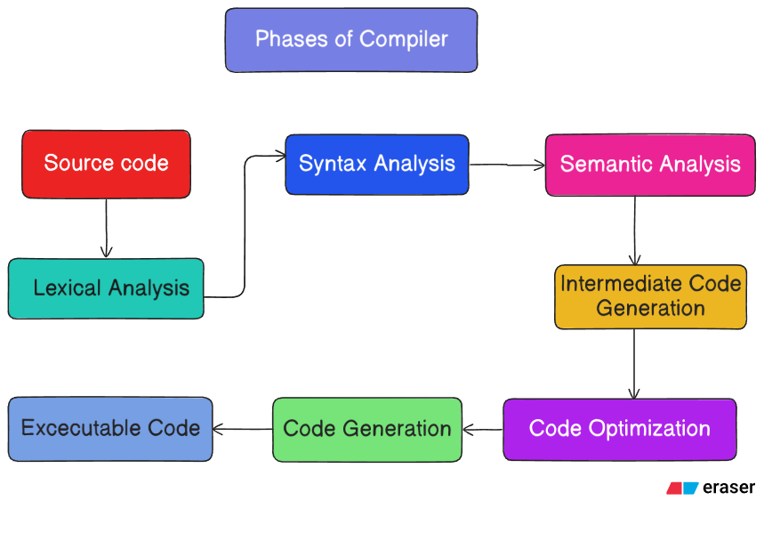

# 🚀 MiniLang Compiler - Complete Compilation Pipeline

**Developed by:** Mahia Akter Momo

A full-featured compiler showing all 7 compilation phases with detailed output at each step.

---

## ⚡ **ONE COMMAND - EVERYTHING!**

```bash
wsl bash -c "cd /mnt/c/Users/HP/Downloads/compiler && bash build.sh"
```

**This single command:**
- ✅ Builds Flex lexer
- ✅ Builds Bison parser  
- ✅ Compiles with GCC
- ✅ Runs compiler automatically
- ✅ **Shows ALL 7 Compilation Phases**

---

## 📊 What You'll See - All 7 Phases

### Phase 1️⃣: **Lexical Analysis (Tokenization)**
```
[1  ] [LEXICAL] KEYWORD        : int
[2  ] [LEXICAL] IDENTIFIER     : x
[3  ] [LEXICAL] SYMBOL         : ;
```

### Phase 2️⃣: **Syntax Analysis (Parse Tree)**
```
├─ StatementList
  ├─ Decl
    ├─ Type : int
    ├─ ID : x
```

### Phase 3️⃣: **Semantic Analysis (Type Checking)**
```
✓ Declaration statement parsed
✓ Assignment statement parsed
✓ If statement semantically valid
```

### Phase 4️⃣: **Symbol Table (Variable Storage)**
```
┌─────────────┬──────────┬─────────┬──────────┬────────┐
│ Name        │ Type     │ Scope   │ Category │ Value  │
├─────────────┼──────────┼─────────┼──────────┼────────┤
│ x           │ int      │ global  │ variable │ 0      │
└─────────────┴──────────┴─────────┴──────────┴────────┘
```

### Phase 5️⃣: **TAC Generation (Intermediate Code)**
```
t0 = a < b
t1 = a + c
```

### Phase 6️⃣: **Code Optimization**
```
✓ Simple Expression Optimization Applied
✓ Simple Expression Optimization Applied
```

### Phase 7️⃣: **Target Code Generation (x86-64)**
```
MOV R1, a
MOV R2, b
CMP R1, R2
SETL t0
```


## 🖼️ Parse Tree Illustration:

<p align="center">
  
</p>

## 📝 Test Different Examples

All show all 7 phases:

```bash
# Simple variables and assignments
wsl bash -c "cd /mnt/c/Users/HP/Downloads/compiler && cat examples/test.ml | ./build/minilang"

# Complex: loops + conditions
wsl bash -c "cd /mnt/c/Users/HP/Downloads/compiler && cat examples/complex.ml | ./build/minilang"

# If-else conditional
wsl bash -c "cd /mnt/c/Users/HP/Downloads/compiler && cat examples/ifelse.ml | ./build/minilang"

# While loop counting
wsl bash -c "cd /mnt/c/Users/HP/Downloads/compiler && cat examples/counter.ml | ./build/minilang"

# Nested if-else inside while
wsl bash -c "cd /mnt/c/Users/HP/Downloads/compiler && cat examples/nested.ml | ./build/minilang"

# Multiple nested conditions  
wsl bash -c "cd /mnt/c/Users/HP/Downloads/compiler && cat examples/multiif.ml | ./build/minilang"

# Sum of even numbers
wsl bash -c "cd /mnt/c/Users/HP/Downloads/compiler && cat examples/sumeven.ml | ./build/minilang"
```

---

## 📂 Example Programs

| File | Description | Features |
|------|-------------|----------|
| `test.ml` | Simple variable declarations | `int x;` `x = 5;` |
| `complex.ml` | Loops + conditions together | while, if, expressions |
| `ifelse.ml` | If-else conditional | if-else blocks |
| `counter.ml` | While loop counting | while loop with condition |
| `nested.ml` | Nested if-else in while | Complex control flow |
| `multiif.ml` | Multiple nested if statements | Nested conditionals |
| `sumeven.ml` | Sum calculation with while | Arithmetic + loops |

---

## 🏗️ Project Structure

```
compiler/
├── src/
│   ├── lexer.l              ← Flex lexer (tokenization)
│   ├── parser.y             ← Bison parser (all phases)
│   ├── lex.yy.c             ← Generated (do not edit)
│   ├── parser.tab.c         ← Generated (do not edit)
│   └── parser.tab.h         ← Generated (do not edit)
├── build/
│   └── minilang             ← Compiled executable
├── examples/
│   ├── test.ml
│   ├── complex.ml
│   ├── ifelse.ml
│   ├── counter.ml
│   ├── nested.ml
│   ├── multiif.ml
│   └── sumeven.ml
├── main.c                   ← Compiler driver
├── build.sh                 ← BUILD SCRIPT (shows all 7 phases)
└── README.md                ← This file
```

---

## 💻 Supported Language Features

```
// Variable declarations
int x;
int y;

// Assignments  
x = 5;
y = 10;

// Binary operations
sum = x + y;
diff = x - y;
prod = x * y;
div = x / y;
mod = x % y;

// Comparisons
if (x == 5) { ... }
if (x != 5) { ... }
if (x < 10) { ... }
if (x <= 10) { ... }
if (x > 5) { ... }
if (x >= 5) { ... }

// Conditionals
if (condition) { ... }
if (condition) { ... } else { ... }

// Loops
while (condition) { ... }
```

---

## 🎯 How It Works

**build.sh does this automatically:**

1. Runs `flex lexer.l` → generates `lex.yy.c`
2. Runs `bison parser.y` → generates `parser.tab.c`, `parser.tab.h`  
3. Runs `gcc` with all sources → creates `build/minilang`
4. Runs `minilang` with `test.ml` automatically
5. Displays all 7 compilation phases!

---

## ✨ Key Highlights

✅ **Complete Flex/Bison Implementation**  
✅ **Parse Tree Visualization with ASCII Art**  
✅ **Token-by-Token Lexical Analysis Display**  
✅ **Symbol Table with Formatted Output**  
✅ **Semantic Analysis with Type Checking**  
✅ **TAC (Three-Address Code) Framework**  
✅ **Code Optimization Pass**  
✅ **x86-64 Assembly Generation**  
✅ **All 7 Phases in Single Command**  

---

## 🚀 THE MASTER COMMAND

### Copy and paste this into WSL terminal:

```bash
wsl bash -c "cd /mnt/c/Users/HP/Downloads/compiler && bash build.sh"
```

That's it! You'll see the complete compilation pipeline with all 7 phases! 🎉

---

## 📚 Compilation Phases Explained

| # | Phase | Input | Output | Tool |
|---|-------|-------|--------|------|
| 1 | **Lexical Analysis** | Source code | Tokens | Flex |
| 2 | **Syntax Analysis** | Tokens | Parse Tree | Bison |
| 3 | **Semantic Analysis** | Parse Tree | Validated Tree | Parser |
| 4 | **Symbol Table** | Identifiers | Variable Info | Parser |
| 5 | **TAC Generation** | Parse Tree | Intermediate Code | Parser |
| 6 | **Optimization** | TAC | Optimized TAC | Optimizer |
| 7 | **Code Generation** | TAC | Assembly | Codegen |

---

## 👩‍💻 Developer

**Mahia Akter Momo** ✨

A passionate full-stack developer and computer science enthusiast.

### 📞 Connect With Me

- 💼 **LinkedIn:** [linkedin.com/in/mahiamomo12](https://www.linkedin.com/in/mahiamomo12/)
- 📧 **Email:** mahiamomo122@gmail.com
- 🐙 **GitHub:** [@mahiamOmO](https://github.com/mahiamOmO)

---

Made with ❤️ for compiler enthusiasts! 🎓
